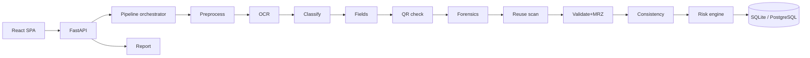

# ID-SHIELD

**Explainable Identity & Document Forensics Platform**
Smart India Hackathon 2026 · SIH26188 · Team HackHive

> **Smart Verification. Stronger Security.**
> One document can look legitimate. An identity evidence set may still be inconsistent.

---

## Problem

Manual identity verification is slow and error-prone — and the hardest fraud is rarely a single obviously-fake document. It is a **set of individually plausible documents that disagree with each other**: different dates of birth, altered name spellings, contradictory addresses, edited photo regions, reused scans.

Most tools stop at OCR or a fake/real classifier. That answers *"what does the document say?"* — not *"does this evidence make sense together?"*

## Solution: Evidence Fusion

ID-SHIELD is an **identity forensics assistant**, not a verdict machine.

```
Upload → Extract → Inspect → Compare → Connect → Score → Explain → Human Verify
```

For every submitted document set it runs:

| Stage | What happens |
|---|---|
| Preprocessing | Resize cap, skew estimation, deskew — originals are never modified |
| OCR | Tesseract (multi-pass) with real per-word confidences; EasyOCR fallback |
| Classification | Keyword-signature templates (passport, national ID, PAN-like, licence, visa, address proof, certificate) |
| Field extraction | Label-driven extraction with normalization (ISO dates, folded names) |
| QR cross-check | Decodes QR payloads and compares against printed fields |
| Visual forensics | Chromatic-noise uniformity + conservative ELA → localized suspicion regions with bounding boxes |
| Duplicate / reuse scan | Exact SHA-256 reuse across all cases |
| Validation | Format checks, date logic, expiry, mandatory fields, **ICAO TD3 MRZ checksums** |
| Cross-document consistency | Field-appropriate comparators across documents (name initials-aware, noise-tolerant addresses, type-scoped doc numbers) |
| Risk scoring | Configurable weighted fusion → 0-100 score with a fully cited ± ledger |

Every point of the score is traceable. High-risk cases are always routed to **human verification** — the system never claims legal authenticity or proven fraud.

---

## Features

- Multi-document case workflow with drag & drop upload, previews, live pipeline status
- Real OCR (Tesseract) with confidence metrics; graceful `unavailable` states when engines are missing
- MRZ parsing with ICAO 7-3-5 checksums and printed-field cross-checks
- QR payload ↔ printed text comparison
- Transparent visual tampering indicators with annotated region overlays
- Cross-document mismatch matrix with highlighted differences and cited explanations
- Explainable risk score (`Why this score` ledger on every case)
- Final verification report with print / save-as-PDF
- Screening history with search, outcome filters and risk sorting
- Dashboard derived entirely from stored data (no hardcoded numbers)
- One-click synthetic demo case + seedable demo dataset
- Responsive layout (desktop / tablet / phone), print stylesheet, accesAsibility passes

## Run anywhere: Offline PC + Online deployment

**Offline (your PC, no internet):** everything — OCR, forensics, database,
UI — runs locally. Double-click **`start_idshield.bat`** after one-time setup:

```powershell
powershell -ExecutionPolicy Bypass -File scripts\setup_offline.ps1
```

Build a shareable installer zip for any Windows PC (optionally bundling all
Python dependencies for fully air-gapped install):

```powershell
powershell -ExecutionPolicy Bypass -File scripts\make_offline_package.ps1 -IncludeWheels
```

**Online (deploy to the internet):** a production `Dockerfile` + compose file
ship with the repo; the container serves UI + API on one port.

```bash
docker compose up --build      # local container test
```

Step-by-step guides for Render / Fly.io / HF Spaces / VPS:
[docs/deployment.md](docs/deployment.md).

**Which is better?** They serve different purposes and you can have both from
this single codebase: the offline build is ideal for demos on unreliable
venue Wi-Fi and keeps documents fully private on your device; the online
deployment gives a shareable link reviewers can open anywhere. Neither is a
fork — deploy the same commit you run offline.

## Architecture

See [docs/architecture.md](docs/architecture.md) for diagrams and module map.



## Technology Stack

| Layer | Choice |
|---|---|
| Frontend | React 18, Vite 5, TypeScript, Tailwind CSS, Recharts, lucide-react |
| Backend | Python 3.11+, FastAPI, Pydantic v2, SQLAlchemy 2 |
| Database | SQLite (dev default), PostgreSQL-compatible schema via `DATABASE_URL` |
| OCR | pytesseract (Tesseract 5), EasyOCR fallback |
| Vision | OpenCV (headless), Pillow, numpy, imagehash |
| QR/MRZ | OpenCV QRCodeDetector; own ICAO TD3 parser |

## Setup

Prerequisites: Python 3.11+, Node 18+, [Tesseract](https://github.com/UB-Mannheim/tesseract/wiki) (Windows installer also works via `winget install UB-Mannheim.TesseractOCR`).

```bash
# 1. Backend
python -m venv .venv
.venv\Scripts\pip install -r backend\requirements.txt      # Windows
# .venv/bin/pip install -r backend/requirements.txt        # Linux/macOS

# 2. Frontend
cd frontend && npm install && cd ..

# 3. Configure (optional — sane defaults work out of the box)
copy .env.example .env
```

### Running

Development (both servers, hot reload):

```powershell
powershell -File run_dev.ps1     # Windows
bash run_dev.sh                  # Linux/macOS
```

Manual:

```bash
# terminal 1
cd backend && ..\.venv\Scripts\python -m uvicorn app.main:app --reload --port 8000
# terminal 2
cd frontend && npm run dev
```

Open **http://localhost:5173**.

Production-style single process (UI served by the API):

```bash
cd frontend && npm run build && cd ..
cd backend && ..\.venv\Scripts\python -m uvicorn app.main:app --port 8000
# open http://localhost:8000
```


### Environment variables

See [.env.example](.env.example): `DATABASE_URL`, `CORS_ORIGINS`, `UPLOAD_DIR`, `MAX_UPLOAD_MB`, `FACE_VERIFICATION_ENABLED`, `LOG_LEVEL`, `VITE_API_BASE`. Never commit `.env`.

## Demo

The fastest tour:

1. Open the app → **Screen Documents** → **Load Demo Case**.
   This creates the synthetic *Rahul Sharma* case: passport A + national ID B agree (DOB 2001-05-12); PAN C shows DOB 1999-05-12 **and carries a genuinely manipulated pixel strip**. Expected outcome: HIGH-risk style review with cited evidence.
2. Watch the live pipeline, then explore tabs: Documents (OCR + confidences) → Validation (MRZ checksums ✓) → Comparison (**DOB MISMATCH** highlighted) → Forensics (suspicious region boxed on the image) → Report (print-ready).
3. Seed the whole dataset: `python -m demo.seed_cases` (6 synthetic cases incl. reuse detection).

All persons/documents are fictional and visibly labeled. Details: [docs/demo-guide.md](docs/demo-guide.md).

## API

Full reference: [docs/api.md](docs/api.md). Quick list:

```
GET    /api/health
POST   /api/cases                       GET /api/cases?search=&outcome=&sort=
GET    /api/cases/{id}                  POST /api/cases/{id}/documents
POST   /api/cases/{id}/analyze          GET /api/cases/{id}/analysis
GET    /api/cases/{id}/comparison       GET /api/cases/{id}/validations
GET    /api/cases/{id}/forensics        GET /api/cases/{id}/risk
GET    /api/cases/{id}/report           GET/DELETE /api/documents/{id}[/file]
GET    /api/dashboard/summary           GET /api/dashboard/recent
POST   /api/demo/signature-case
```

## Limitations

- Heuristic forensics detect **indicators**, not proof; sophisticated forgeries can pass, clean scans can trigger weak signals.
- OCR quality depends on input quality; extraction relies on label patterns of supported layouts.
- Synthetic documents do not represent all real-world formats; new templates are additive but must be registered.
- No liveness detection; face verification is stubbed behind a flag (P2).
- Reuse detection uses exact file hashing in the pipeline (perceptual matching disabled for flat scans).
- The prototype has **no connection to government databases**; any authoritative verification would require authorized issuer integrations.

## Future Scope

Advanced face verification & liveness · fraud-ring analytics over the identity graph · issuer/government API integrations · multilingual OCR & UI · perceptual reuse tuned per document class · AI-assisted explanation drafting · PDF report export server-side.

## Disclaimer

> ID-SHIELD is a prototype for **assisted** identity verification. It does not determine legal authenticity. Final verification decisions must be made by authorized human personnel. All bundled data is synthetic.
