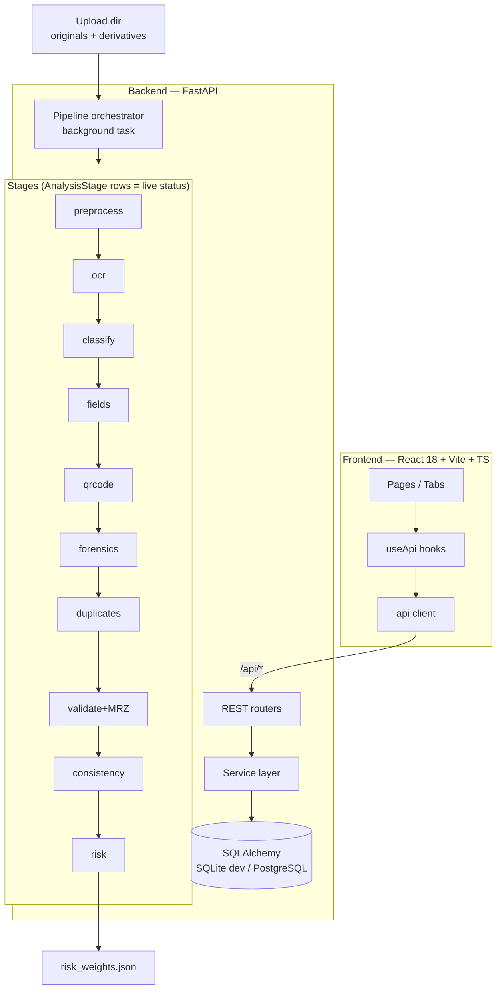

# Architecture

## System overview



## Key design rules

1. **Originals are sacred.** `data/uploads/{case_id}/{uuid}.png` is never modified. Preprocessed derivatives (`*_processed.png`) are separate files referenced by `Document.processed_path`. Forensics always analyzes the pristine original.
2. **The pipeline is honest.** Each stage persists `done | warning | unavailable | error` with a human-readable detail. A missing OCR engine produces `unavailable`, never fake output. Partial results are preserved.
3. **Evidence lives in rows.** Extracted fields, validation results, forensic findings, cross-document findings and risk factors are database entities — the UI renders them, nothing is hardcoded per-case.
4. **Detectors are pluggable services** behind small modules (`ocr_service`, `forensic_service`, `mrz_service`, `qr_service`, `duplicate_service`). Adding a template or detector does not require touching the orchestrator.

## Module map (backend/app)

| Path | Responsibility |
|---|---|
| `core/config.py` | Env-driven settings |
| `core/security.py` | Upload validation, filename sanitization, path-traversal guard |
| `core/risk_weights.json` | Configurable scoring policy |
| `db/models.py` | User, Case, Document, ExtractedField, ValidationResult, CrossDocumentFinding, ForensicFinding, RiskFactor, Report, AnalysisStage |
| `services/pipeline.py` | Stage runner, timing, status persistence, graceful degradation |
| `services/ocr_service.py` | Tesseract multi-pass (normal/inverted/bottom-strip) → EasyOCR → unavailable |
| `services/preprocessing_service.py` | PDF render, resize cap, projection-profile deskew (conservative by design) |
| `services/classifier_service.py` | Template registry + aspect heuristics |
| `services/extraction_service.py` | Label-driven field extraction, name-part composition, header-band guard |
| `services/mrz_service.py` | ICAO TD3 parse, 7-3-5 checksums, homoglyph repair, field cross-checks |
| `services/qr_service.py` | QR decode + payload-vs-printed comparison |
| `services/forensic_service.py` | Chroma-uniformity detector + conservative ELA, region maps |
| `services/duplicate_service.py` | Exact/perceptual reuse matching |
| `services/consistency_service.py` | Agreement clustering, comparators, severity, explanations |
| `services/risk_engine.py` | Weighted fusion, caps, gating policy, bands |
| `services/validation_service.py` | Format/logic/expiry/mandatory checks, overall doc status |
| `api/routes_*` | Thin REST layer over services |

## Frontend structure

```
src/
├── components/
│   ├── layout/      AppLayout, Sidebar, MobileDrawer, ErrorBoundary…
│   ├── dashboard/   MetricCard(+skeleton), StatusBadge
│   └── documents/   ValidationTab, ComparisonTab, ForensicsTab, ReportTab, DocImage
├── pages/           Landing, Dashboard, NewCase, Processing, CaseDetail,
│                    History, Reports, Analytics/Users/Settings placeholders
├── hooks/useApi.ts  GET state hook (loading/error/data/reload)
├── services/api.ts  fetch wrapper (JSON + multipart), ApiError
└── types/api.ts     Backend contract mirrors
```

Single-origin production build: FastAPI serves `frontend/dist` (SPA fallback) so one process hosts UI + API; in dev Vite proxies `/api`.
